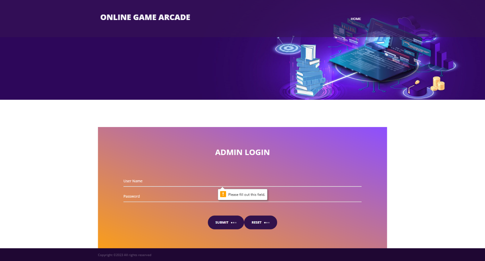
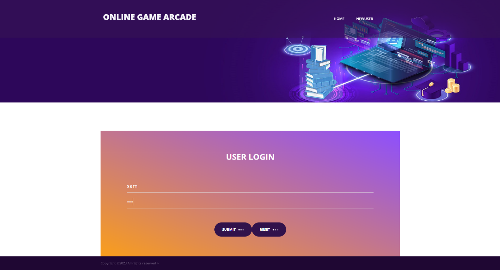
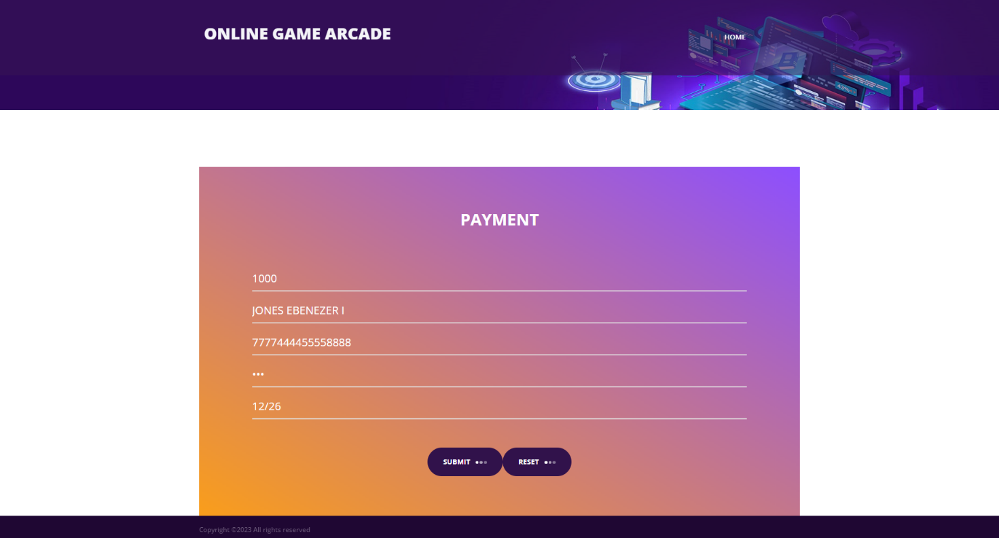
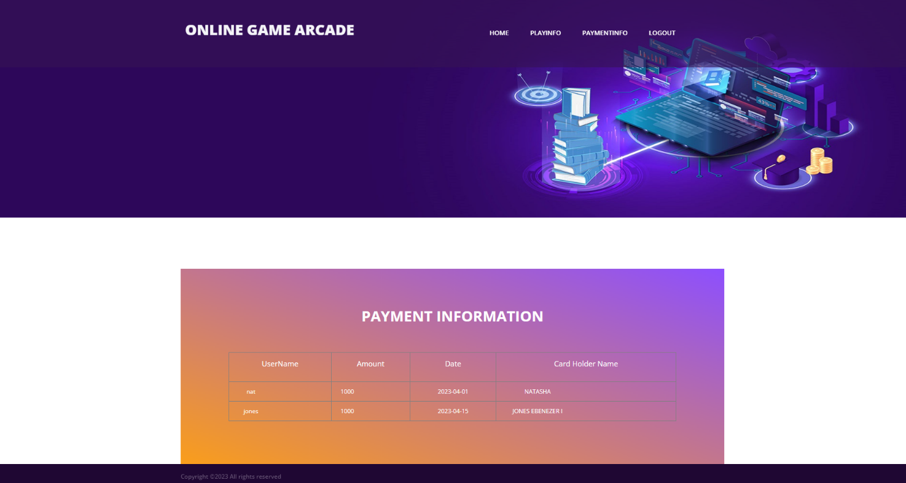
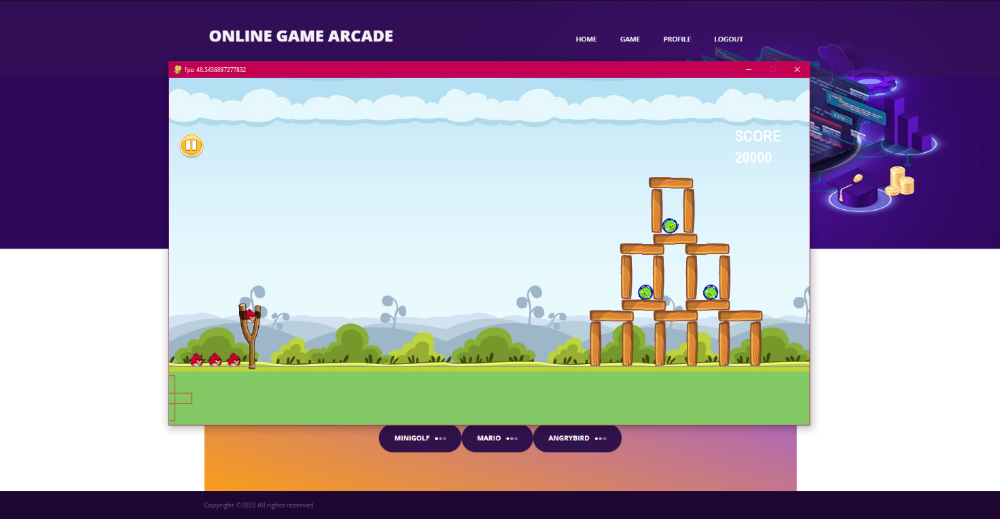
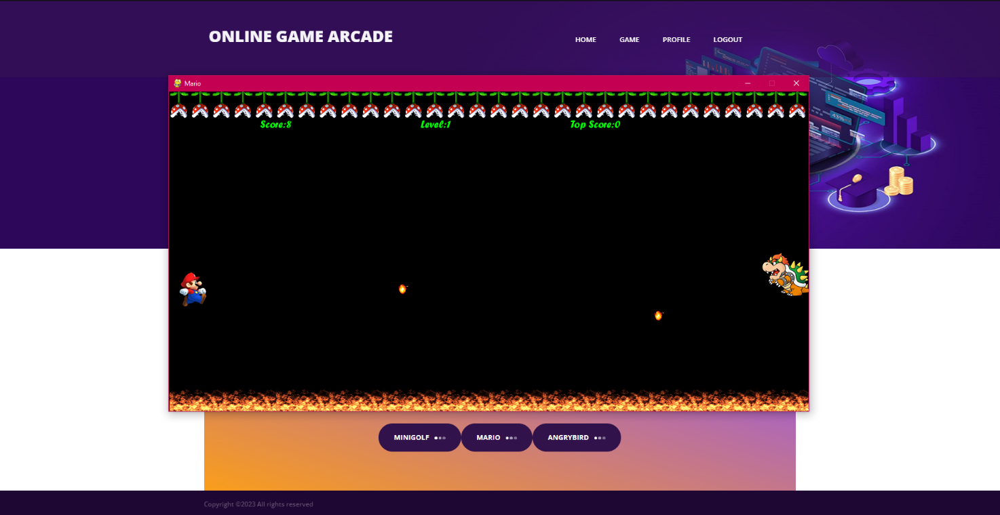
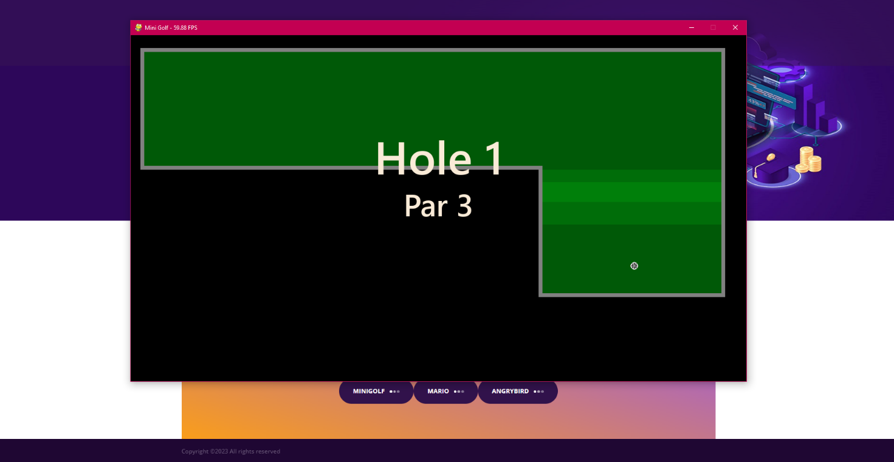

## Title - Online Game Arcade 

##  Introduction

Online Game Arcade is a web-based entertainment platform designed to bring the joy of classic and casual games directly to users — no installation or download required. Built using Python, Flask, and Pygame, this platform allows players of all ages and skill levels to instantly enjoy fast-paced, engaging games like Minigolf, Super Mario, and Angry Bird — all accessible through any web browser.

This project blends the simplicity of arcade-style games with the convenience of modern web technologies, enabling seamless gameplay on desktops, laptops, tablets, and smartphones. It combines the power of a Flask web server with MySQL integration for player data storage and pymunk physics for enhanced in-game realism.

Whether you're looking for a fun way to pass the time, test your reflexes, or relive your arcade nostalgia, Online Game Arcade offers a lightweight yet thrilling experience. With minimal controls, easy-to-understand gameplay, and dynamic graphics, the platform emphasizes accessibility, speed, and user engagement.

##  Structure 

├── data/ # Data files or gameplay-related assets

├── resources/ # Game-related images, sounds, or fonts

├── static/ # Static files for the Flask app (CSS, JS, images)

├── templates/ # HTML templates for Flask rendering

├── angrybird.py # Angry Bird game script

├── mario.py # Mario game script

├── minigolf.py # Mini Golf game script

├── app.py # Flask main app file

├── arcadiadb.sql # SQL file to set up the MySQL database

├── player-stats.json # Sample JSON player stats

├── requirements.txt # Required Python packages

## Setup Instructions

1. Clone the Repository

    bash - git clone 

    https://github.com/yourusername/your-repo-name.git

    cd your-repo-name

2. Create Virtual Environment

   bash
   
   python -m venv venv
   
   source venv/bin/activate # On Windows: venv\Scripts\activate

3. Install Dependencies
   
   bash
    
   pip install -r requirements.txt

4. Set Up the Database

   Import arcadiadb.sql into your MySQL server:

   sql
  
   CREATE DATABASE arcade;
   
   USE arcade;
   
   -- then run arcadiadb.sql content
   
   Update your MySQL credentials in app.py or a config file.

5. Run the Web Application
   
   bash
   
   python app.py

   Then go to http://127.0.0.1:5000/ in your browser.

## Screenshots

####  Home Page

####  Admin Page

####  User Page

####  User Detail Page

####  User Payment Page

####  User Payment Information Page

####  Angry Bird 🎮

####  Mario 🎮

####  Mini Golf 🎮

## Future scope

Online Game Arcade is highly promising, driven by rapid advancements in gaming technology and user expectations. Emerging technologies like Virtual and Augmented Reality will enable more immersive and interactive experiences that blur the line between physical and digital worlds. Cloud gaming will remove hardware limitations, allowing high-quality gameplay across a range of devices, while cross-platform compatibility will ensure seamless gaming experiences for users on desktops, mobiles, and consoles. The integration of Artificial Intelligence will enhance realism through intelligent NPCs and adaptive gameplay environments. Furthermore, the growing trend of social and community gaming will encourage the development of features that promote player interaction, engagement, and competition. Overall, the future of Online Game Arcade is bright, offering exciting opportunities to redefine casual gaming through innovation, accessibility, and connected experiences.